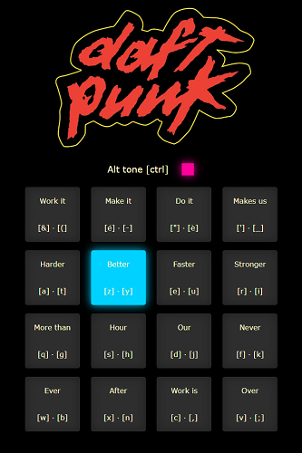
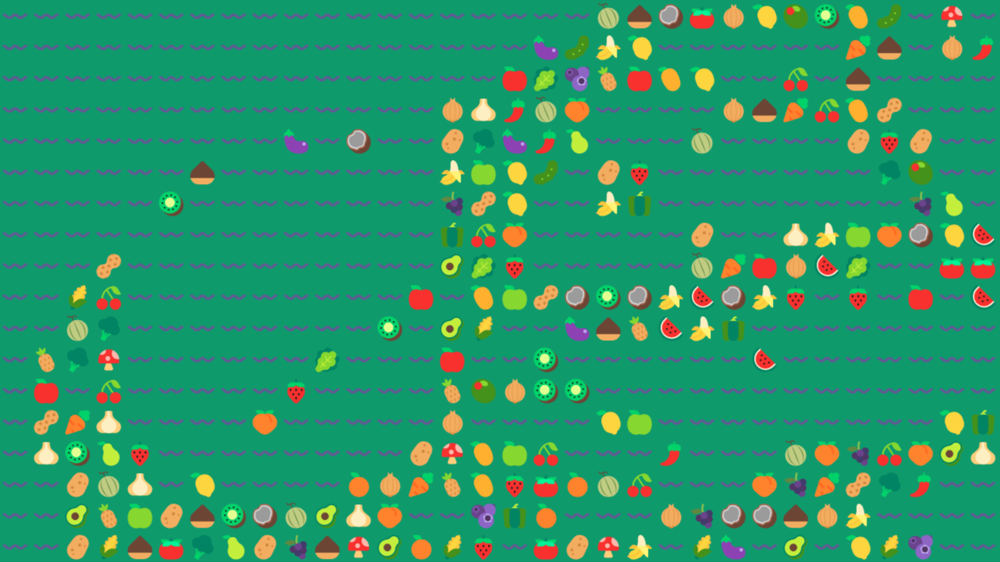
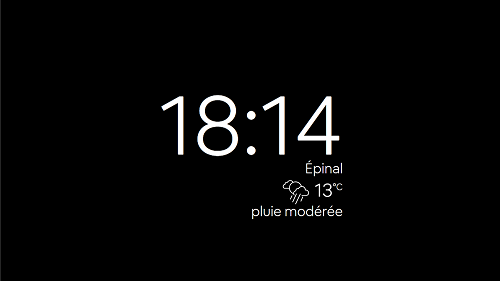
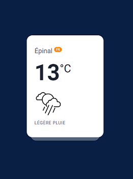

# Wonderful Web Project

Just useless web things. Because why not.

# Funny

## Daft Punk soundboard

A soundboard for the Harder, Better, Faster, Stronger song. [Try it here.](daft_punk/)

## DVD logo

A DVD logo screensaver. [Try it here.](dvd/)

## Emoji grid

Random emojis will appear. [Try it here.](emoji_grid/)

# Weather related

## Simple weather clock

Simple clock displaying the weather, it can be customized. [Try it here.](simple_weather_clock/)

## Weather card

Card displaying the weather. [Try it here.](weather_card/)

# Color related

* A useful dark screen: [try it here](blackscreen/)
* A useful bright screen: [try it here](whitescreen/)
* A random color screen: [try it here](random_color/)

# Day related

* Know the current day: [try it here](today/)
* Know the not current day: [try it here](not_today/)
* Know if you can MEP today: [try it here [fr]](est_ce_quon_met_en_prod_aujourdhui/)
* Know if it is the weekend: [try it here [fr]](est_ce_que_cest_le_weekend/)

# Really useless

* Try to find it: [try it here](hide_and_seek/)
* Try to click it: [try it here](runaway_button/)
* Know if your device is on: [try it here](is_my_device_on/)
